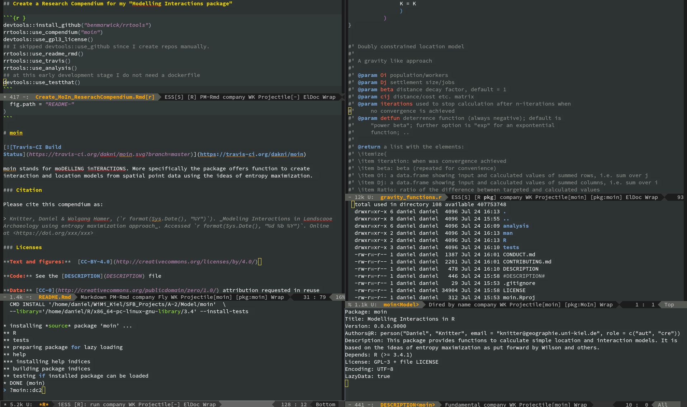
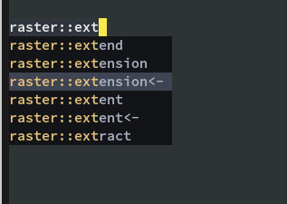
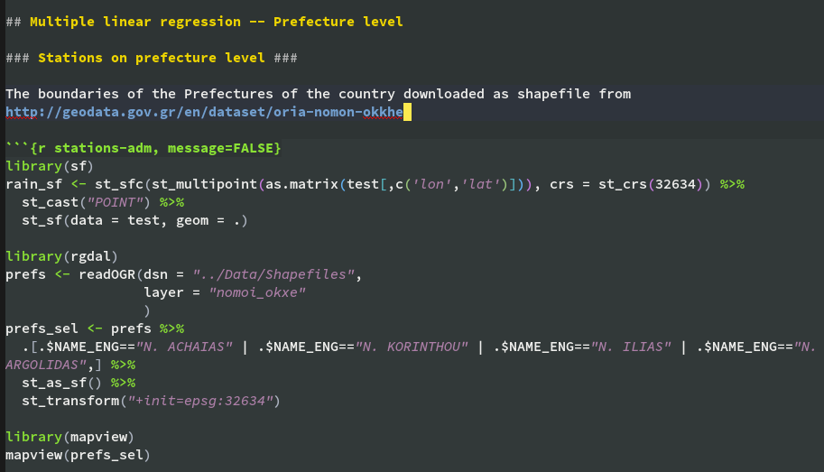
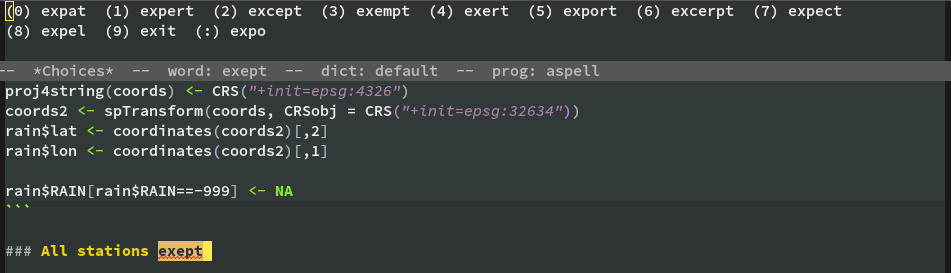
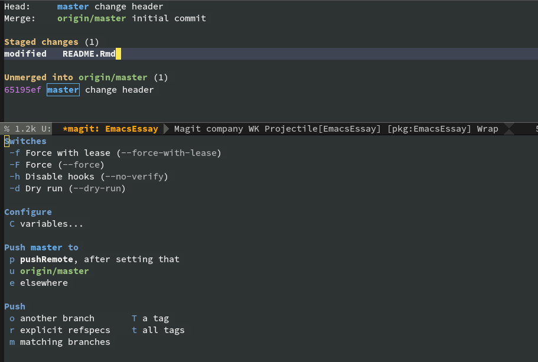
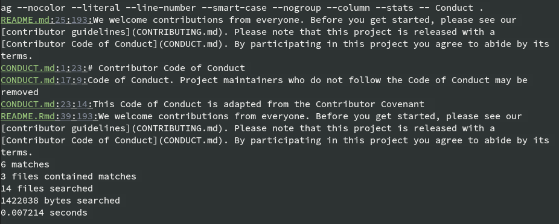
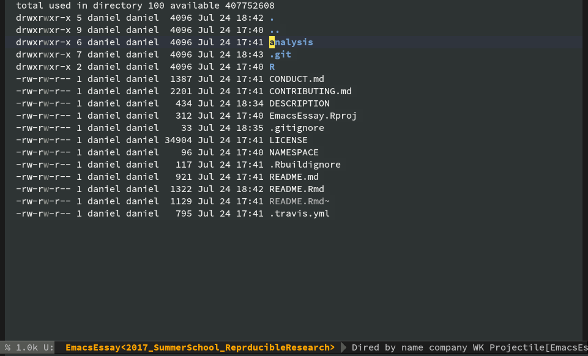

<!-- This is the format for text comments that will be ignored during renderings. Do not put R code in these comments because it will not be ignored. -->

```{r, setup, echo = FALSE}
knitr::opts_chunk$set(
  collapse = TRUE,
  warning = FALSE,
  message = FALSE,
  echo = TRUE,
  comment = "#>",
  fig.path = "figures"
)
```

# Introduction



Although RStudio is one of the most popular GUIs for R, offering a lot of convenient features, there are still many users using a different setup to work with R, develop their packages, write their papers, etc. 

Here I want to show the ease of using Emacs and some of its add-on package as a all-in-one working environment solution for reproducible research using R. In order to use R within Emacs one has to install the ESS, i.e. emacs speaks statistics, add-on. But, is it worthwhile to use it instead of RStudio? Here is the answer of Hadley Wickham: "The only real competitor [to RStudio] is [ESS, emacs speaks statistics](http://ess.r-project.org/), which is a rewarding environment if you’re willing to put in the time to learn emacs and customise it to your needs. The history of ESS stretches back over 20 years (predating R!), but it’s still actively developed (...)" [@wickham_r_2015, p. 19].

New to Emacs? Here are some resource that help get you starting

- [Emacs tutorials and Courses](https://hackr.io/tutorials/learn-emacs)
- [Hand drawn one pager for Emacs beginners by Sacha Chua](http://sachachua.com/blog/2013/05/how-to-learn-emacs-a-hand-drawn-one-pager-for-beginners/)
- [How to learn Emacs](http://david.rothlis.net/emacs/howtolearn.html)

# Get the required add-ons

Emacs has its own packaging system so its is very easy to install and setup new packages. Put this is the init file of your Emacs (located under `$USER/.emacs.d/init.el`) in order to setup some package repositories. Subsequently we install [use-package](https://github.com/jwiegley/use-package) that simplifies the process of package installation and maintenance. 

```
;;; Set up package
(require 'package)
(setq package-archives
      '(("melpa" . "https://melpa.org/packages/")
        ("gnu" . "https://elpa.gnu.org/packages/")
        ("org" . "http://orgmode.org/elpa/")))
(package-initialize)


;;; Bootstrap use-package
;; Install use-package if it's not already installed.
;; use-package is used to configure the rest of the packages.
(unless (package-installed-p 'use-package)
  (package-refresh-contents)
  (package-install 'use-package))

(eval-when-compile
  (require 'use-package))
```

## Emacs Speaks Statistics (ESS)

Here is a simple [ess](https://ess.r-project.org/) setup. It takes care that your scripts follow the style guidelines of RStudio, adds a shortcut for [magrittr](https://cran.r-project.org/web/packages/magrittr/)'s pipe operator, and creates a function to simply insert chunks into a Rmd document.

```
(use-package ess
  :ensure t ;; this will install ess from the add-on repositories in case it is not yet installed
  :init (require 'ess-site) ;;--> This will set the associations for R-mode, julia-mode and Rnw-mode.
  :config  
  (add-hook 'ess-mode-hook
            (lambda ()
              (ess-set-style 'RStudio))) ;; amount of spaces of a tab; indentation levels;
  (setq ess-eval-visibly 'nowait) ; don't hog Emacs
  (setq ess-pdf-viewer-pref "evince") ; select software to open pdfs with

  (defun my/add-pipe ()
    "Adds a pipe operator %>% with one space to the left and then
starts a newline with proper indentation"
    (interactive)
    (just-one-space 1)
    (insert "%>%")
    (ess-newline-and-indent))
    (define-key ess-mode-map (kbd "M-p") #'my/add-pipe)

    ;; https://emacs.stackexchange.com/questions/27405/insert-code-chunk-in-r-markdown-with-yasnippet-and-polymode
    (defun tws-insert-r-chunk (header) 
    "Insert an r-chunk in markdown mode. Necessary due to interactions between polymode and yas snippet" 
    (interactive "sHeader: ") 
    (insert (concat "```{r " header "}\n\n```")) 
    (forward-line -1))
)
```

### Autocomplete

Of course there is autocompletion. There are different possibilities. At the moment I prefer [company mode](http://company-mode.github.io/).

```
(use-package company
  :ensure t
  :init
  (add-hook 'after-init-hook 'global-company-mode)
  :bind
  ("<C-tab>" . company-complete-common-or-cycle)
  :config
  (setq company-idle-delay 0.30)
  )
```




### Code highlighting/Tab indentation in R and Rmd

This is possible thanks to polymode

```
(use-package polymode
:ensure t
:mode
("\\.Snw" . poly-noweb+r-mode)
("\\.Rnw" . poly-noweb+r-mode)
("\\.Rmd" . poly-markdown+r-mode))
```



### Spellchecking

Spell checking for different languages. This snippet allows to use spell checking and switch languages by pressing `F8` key.

```
(defun fd-switch-dictionary()
      (interactive)
      (let* ((dic ispell-current-dictionary)
         (change (if (string= dic "en_US") "de_DE-neu" "en_US"))) ; en_US
        (ispell-change-dictionary change)
        (message "Dictionary switched from %s to %s" dic change)
        ))
(global-set-key (kbd "<f8>")   'fd-switch-dictionary)

```

Words that are not in the dictionary or that are spelled wrong are underlined. Put the cursor on the word and press `M-$` to see a list of possible corrections or add the word to your personal dictionary. 



## Magit

Since we want to push our changes to github we need an interface to git. This is offered by [magit](https://magit.vc/) "A Git Porcelain inside Emacs". Here is a simple setup. Just paste it in your .init.el and use-package will take care of installing, etc.

```
(use-package magit
  :ensure t
  :bind ("C-x g" . magit-status)
)
```

After this type `C-x g` in any of your reproducible research documents to interact with git.



## Further conveniences

### Project Management

Of course you will write many papers. Hence, project management might be desirable. [projectile](http://projectile.readthedocs.io/en/latest/) might be what you are looking for. 

In this environment searching for phrases, code snippets, etc. in any of the project related files is just one key-stroke away thanks to function `projectile-ag`



### File manager

[Dired](https://www.gnu.org/software/emacs/manual/html_node/emacs/Dired.html) is the directory editor of Emacs that let's you perform all file management related tasks within your project. 



### Please add further tools

# Use `rrtools` in Emacs. 

This is a simple copy paste task. The following code chunks creates your research compendium. Press `M-x` (this is `Alt` key and `x` key) and type `R` to start R. 

Ess will ask you in which directory you want to start `R`. Navigate to the directory where you want you research compendium to be created in and press `Enter`

Afterwards you can send the `rrtools` and `devtools` commands appropriate for your compendium, e.g.:

```{r compendium, eval=FALSE}
devtools::install_github("benmarwick/rrtools")
rrtools::use_compendium("EmacsCompendium")
devtools::use_github(".", auth_token = "xxxx", protocol = "ssh", private = FALSE)
rrtools::use_analysis()
rrtools::use_readme_rmd()
rrtools::use_dockerfile()
rrtools::use_travis()
devtools::use_testthat()
```

## Convenient ESS features.

Want to write a function? Get the skeleton with `M-x` `RET` `ess-insert-function-outline` `RET`

```{r insfun, eval=FALSE}
f <- function()
{
  ## Purpose:
  ## ----------------------------------------------------------------------
  ## Arguments:
  ## ----------------------------------------------------------------------
  ## Author: Daniel Knitter, Date: 24 Jul 2017, 21:59
}
```

And want this function documented using [roxygen](https://github.com/klutometis/roxygen)? Get an outline of the documentation slots using `M-x` `RET` `ess-roxy-update-entry`

```{r roxy, eval=FALSE}
##' .. content for \description{} (no empty lines) ..
##'
##' .. content for \details{} ..
##' @title 
##' @return 
##' @author Daniel Knitter
f <- function()
{
  ## Purpose:
  ## ----------------------------------------------------------------------
  ## Arguments:
  ## ----------------------------------------------------------------------
  ## Author: Daniel Knitter, Date: 24 Jul 2017, 21:55
}
```

### Knit a document

In RStudio by clicking the knit button the document is knitted in a fresh `R` instance that is started in the directory of the `Rmd`. The same behavior is achieved in Emacs by sending a shell-command using `M-!`

```
echo "rmarkdown::render('YOUR-DOCUMENT.Rmd')" | R --vanilla &
```

Sending this command a Shell buffer is opened that informs you about the progress of the document creation. If this takes a long time, no worries. You can just continue working with `R`. 

# References 
